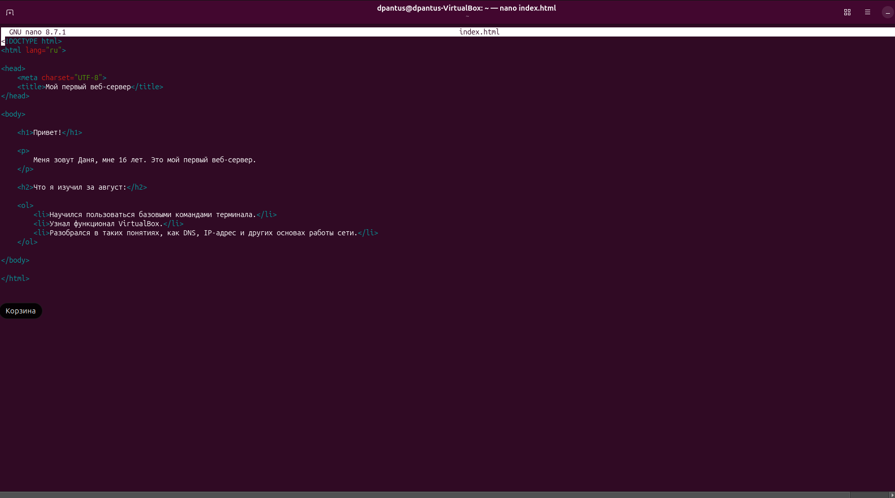
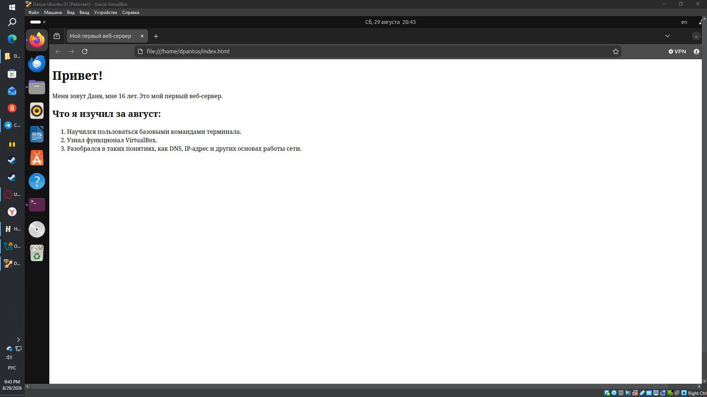

# Мой первый веб-сервер на Nginx

Это мой первый учебный проект на Ubuntu.

## Что я сделал

- Установил Ubuntu в VirtualBox
- Научился пользоваться базовыми командами терминала
- Установил и запустил Nginx
- Создал собственную страницу `index.html`
- Разместил страницу на веб-сервере
- Разобрался с основами DNS и IP-адресов

## Скриншоты

### Терминал Ubuntu

### Страница на Nginx

# Мой первый веб-сервер

## Что я хотел сделать

Я хотел научиться работать с Ubuntu и попробовать самостоятельно запустить простой веб-сервер. Моей задачей было создать HTML-страницу и открыть её через Nginx.

## Что я использовал

- Ubuntu
- VirtualBox
- Nginx
- HTML
- Git
- GitHub

## Что я сделал по шагам

1. Установил и запустил Ubuntu через VirtualBox.
2. Научился использовать базовые команды терминала.
3. Установил и запустил Nginx.
4. Создал файл `index.html`.
5. Написал в нём простую HTML-страницу с информацией о себе.
6. Перенёс `index.html` в папку Nginx.
7. Открыл страницу через `localhost` в браузере.
8. Создал репозиторий на GitHub.
9. Добавил туда файлы проекта и скриншоты.
10. Познакомился с командами `git add`, `git commit` и `git push`.

## Какая проблема возникла

Сначала я не мог найти файл `index.html` через терминал. Также после запуска страницы русские символы отображались неправильно.

## Как я её решил

Я разобрался с командами `cd` и `ls` и нашёл нужный файл в домашней папке.

Проблему с русскими символами решил, добавив в HTML строку `<meta charset="UTF-8">`.

После этого страница начала отображаться правильно.

## Что получилось

В итоге я создал свою первую HTML-страницу и запустил её через Nginx на Ubuntu. Также я создал репозиторий на GitHub и начал разбираться в работе с Git.

## Что хочу попробовать дальше

Дальше я хочу лучше разобраться в Git, научиться работать с CSS и сделать страницу более красивой. Также хочу попробовать разместить сайт так, чтобы к нему можно было получить доступ не только через `localhost`.
